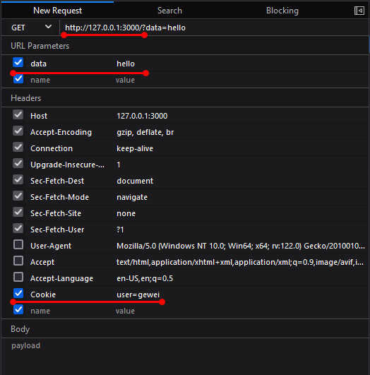

# Context

- [Context](#context)
  - [Context with timeout webservice](#context-with-timeout-webservice)
  - [Cancellation](#cancellation)
  - [Timer](#timer)
  - [Pass Values through the context](#pass-values-through-the-context)

## Context with timeout webservice

Target: calls three web services, send data to two of those services, and then take the results of those two calls and send them to the third, returning the result. The entire process must take less than 50 milliseconds, or an error is returned.

> When there’s a context available, use its timer support rather than calling `time.After`. One of the advantages of using the context’s timer is that it allows us to respect timeouts that are set by the functions that called this function.

- [recommended implementation](ch08/example01.go)
- [simplified implementation](ch08/example02.go), If you trust `callWebServiceC`, Since the context is passed into `callWebServiceC`, the function can be written to respect the timeout and return an error if it was triggered. 
- [simple implementation](ch08/example03.go) by `time.After`, 将`callWebServiceA+callWebServiceB`和`callWebServiceC`两个过程的timeout分开了

## Cancellation

Any time you create a context that has an associated cancel function, you **must** call that cancel function when you are done processing, whether or not your processing ends in an error. If you do not, your program will leak resources (memory and goroutines) and eventually slow down or crash. *There is no error if you call the cancel function more than once*; any invocation after the first does nothing. The easiest way to make sure you call the cancel function is to use `defer` to invoke it right after the cancel function is returned.

```bash
./
    client.go
    servers.go
    main.go

# build program
go build
```

Usage:
- example1: `main.exe true`
- example2: `main.exe false`

```go
// main.go
package main

import (
	"context"
	"os"
)

func main() {
	ss := slowServer()
	defer ss.Close()
	fs := fastServer()
	defer fs.Close()

	ctx := context.Background()
	callBoth(ctx, os.Args[1], ss.URL, fs.URL)
}
```

```go
package main

import (
	"net/http"
	"net/http/httptest"
	"time"
)

func slowServer() *httptest.Server {
	s := httptest.NewServer(http.HandlerFunc(func(w http.ResponseWriter, r *http.Request) {
		time.Sleep(2 * time.Second)
		w.Write([]byte("Slow response"))
	}))
	return s
}

func fastServer() *httptest.Server {
	s := httptest.NewServer(http.HandlerFunc(func(w http.ResponseWriter, r *http.Request) {
		if r.URL.Query().Get("error") == "true" {
			w.Write([]byte("error"))
			return
		}
		w.Write([]byte("ok"))
	}))
	return s
}
```

```go
package main

import (
	"context"
	"errors"
	"fmt"
	"io"
	"net/http"
	"sync"
)

var client = http.Client{}

func callBoth(ctx context.Context, errVal string, slowURL string, fastURL string) {
	ctx, cancel := context.WithCancel(ctx)
	defer cancel()
	var wg sync.WaitGroup
	wg.Add(2)
	go func() {
		defer wg.Done()
		err := callServer(ctx, "slow", slowURL)
		if err != nil {
			cancel()
		}
	}()
	go func() {
		defer wg.Done()
		err := callServer(ctx, "fast", fastURL+"?error="+errVal)
		if err != nil {
			cancel()
		}
	}()
	wg.Wait()
	fmt.Println("done with both")
}

func callServer(ctx context.Context, label string, url string) error {
	req, err := http.NewRequestWithContext(ctx, http.MethodGet, url, nil)
	if err != nil {
		fmt.Println(label, "|request err:", err)
		return err
	}
	resp, err := client.Do(req)
	if err != nil {
		fmt.Println(label, "|response err===>", err, "<===")
		return err
	}
	data, err := io.ReadAll(resp.Body)
	if err != nil {
		fmt.Println(label, "|read err:", err)
		return err
	}
	result := string(data)
	if result != "" {
		fmt.Println(label, "|result:", result)
	}
	if result == "error" {
		fmt.Println("cancelling from|", label)
		return errors.New("error happened")
	}
	return nil
}
```

## Timer

example: control how long an individual call takes by creating a child context

```go
package main

import (
	"context"
	"fmt"
	"time"
)

func main() {
	ctx := context.Background()
	parent, cancel := context.WithTimeout(ctx, 3*time.Second)
	defer cancel()
	child, cancel2 := context.WithTimeout(parent, 2*time.Second)
	defer cancel2()
	start := time.Now()
	<-child.Done()
	end := time.Now()
	fmt.Println("child costs: ", end.Sub(start))
	<-parent.Done()
	end2 := time.Now()
	fmt.Println("parent costs: ", end2.Sub(start))
}
```

```bash
# output
child costs:  2.0138926s
parent costs:  3.0008167s
```

Any timeout that you set on the child context is bounded by the timeout set on the parent context

```go
	parent, cancel := context.WithTimeout(ctx, 3*time.Second)
	child, cancel2 := context.WithTimeout(parent, 4*time.Second)
```

```bash
# output
child costs:  3.0075208s
parent costs:  3.0075208s
```

## Pass Values through the context

> The most common situation is an HTTP request handler and its associated middleware. 

example: server with [identity middleware & guid middleware](ch08/context_values/)

```bash
./
    identity/
        identity.go
    tracker/
        tracker.go
    main.go
	go.mod
	go.sum

# build program
go build
```

test program in firefox:


